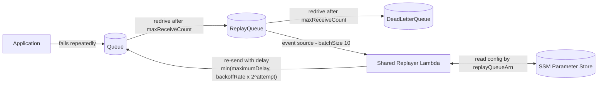

# @tarantoj/sqs-replay-backoff

An [AWS CDK](https://docs.aws.amazon.com/cdk/v2/guide/home.html) construct library that replays messages back to an SQS queue with exponential backoff. Messages that repeatedly fail processing are driven through a `Queue -> ReplayQueue -> DeadLetterQueue` chain and re-injected into the source queue with an increasing delay, up to a configurable attempt limit, after which they are finally dead-lettered.

The replayer is a single shared [Rust](https://www.rust-lang.org/) Lambda (custom runtime) per CDK app. It is cross-compiled and shipped prebuilt inside this package, so consumers do not need a Rust toolchain or Docker.

## Constructs

### `SqsReplayer`

Registers a replay queue with the app's shared replayer Lambda. The Lambda is triggered by the `replayQueue` (typically the DLQ of the queue you want to protect), re-sends each message back to a `sourceQueue` with a delay computed as `min(maximumDelay, backoffRate * 2^attempt)`, and reports a batch item failure once `maxAttempts` is exceeded. Set `useJitter` to add full jitter, spreading the delays for an attempt uniformly between 0 and that bound.

```ts
import { aws_sqs, Duration } from "aws-cdk-lib";
import { SqsReplayer } from "@tarantoj/sqs-replay-backoff";

const sourceQueue = new aws_sqs.Queue(this, "SourceQueue");
const replayQueue = new aws_sqs.Queue(this, "ReplayQueue");

new SqsReplayer(this, "Replayer", {
  sourceQueue,
  replayQueue,
  maxAttempts: 5,                    // default 5
  backoffRate: Duration.seconds(30), // default 30 seconds
  maximumDelay: Duration.minutes(15),// default 15 minutes
  useJitter: true,                   // default false
});
```

Every `SqsReplayer` in the same CDK app shares **one** reaper Lambda. Each instance adds its own SQS event source mapping (so messages from different replay queues fan into the same function) and registers its destination in SSM Parameter Store; the Lambda resolves the destination per event from the record's `eventSourceARN`.

### `SqsQueueWithReplay`

Convenience construct that creates the full queue topology (`Queue -> ReplayQueue -> DeadLetterQueue` with redrive policies) and wires up an `SqsReplayer`.

```ts
import { Duration } from "aws-cdk-lib";
import { SqsQueueWithReplay } from "@tarantoj/sqs-replay-backoff";

const { queue, replayQueue, deadLetterQueue, replayer } =
  new SqsQueueWithReplay(this, "QueueWithReplay", {
    visibilityTimeout: Duration.seconds(18), // default 18 seconds
    maxReceiveCount: 5,                     // default 5
    maxAttempts: 5,
  });
```

Any number of `SqsQueueWithReplay` constructs share the same reaper Lambda.

> **FIFO queues are not supported.** SQS does not allow per-message delays on FIFO queues, and its 5-minute deduplication window silently drops replayed copies, so backoff replay is impossible. Passing `fifo: true` fails synthesis.

## Configuration store

Per-queue configuration is stored in [SSM Parameter Store](https://docs.aws.amazon.com/systems-manager/latest/userguide/systems-manager-parameter-store.html). For each `SqsReplayer`, a `StringParameter` is created under `/sqs-replay/queues/` whose value carries the replay queue ARN, the destination queue URL, and the backoff tuning:

```json
{
  "replayQueueArn": "arn:aws:sqs:us-east-1:123456789012:ReplayQueue",
  "destinationQueueUrl": "https://sqs.us-east-1.amazonaws.com/123456789012/Queue",
  "maxAttempts": 5,
  "backoffRate": 30,
  "maximumDelay": 900,
  "useJitter": false
}
```

The Lambda loads the full path on cold start and caches it for ~60 seconds, so new queues are picked up without a redeploy. Set `configPath` on `SqsReplayer` (or `SqsQueueWithReplay`) to change the SSM path.

### How it works



1. Messages failing to be consumed are moved to the `ReplayQueue` by the source queue's redrive policy.
2. The shared reaper Lambda (triggered by each `ReplayQueue` with `batchSize: 10` and `reportBatchItemFailures`) looks up the destination for the event's `eventSourceARN`, then re-sends each message to that source queue with an exponential delay tracked by the `sqs-dlq-replay-num` message attribute.
3. Once a message has been replayed `maxAttempts` times it is reported as a failed batch item, so it is redriven from `ReplayQueue` into the final `DeadLetterQueue`. Messages that are malformed (no body or an invalid replay count) are reported as failed batch items too, so a single bad record never fails the whole batch.

Function-level Lambda options (memory, timeout, VPC, `functionName`, `logRetention`, `code`, `environment`) apply to the shared function the first time it is created in an app; later instances' values are ignored.

## Tracing

X-Ray tracing is enabled on the replayer Lambda by default. Each replayed message carries the original producer's `AWSTraceHeader` (an SQS system attribute) through the replay queue and onto the re-sent `SendMessage`, so every replay attempt appears as part of the same distributed trace. No configuration is required.

## Development

The development environment is managed by [devenv](https://devenv.sh/).

```sh
devenv shell           # enter the dev shell (node, npm, cargo, cargo-zigbuild, ...)
npx projen             # synthesize all projen-managed files
npm run build          # bundles the Rust lambda, compiles the jsii library, runs tests
cd lambda && cargo test
```

See [AGENTS.md](./AGENTS.md) for repository conventions.

## License

Apache-2.0